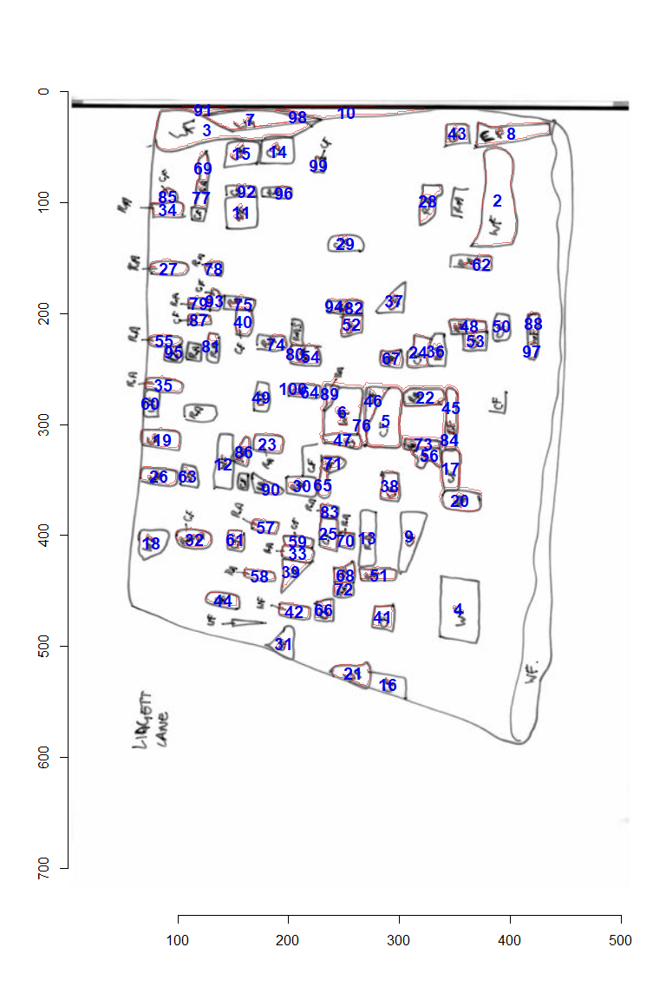

example shape area 2
================
barrett wolfe
2022-07-02

``` r
library(imager)
library(scales)
library(Momocs)

img <- load.image("areas2.jpg")
img.g <- grayscale(img)
area.list <- split_connected(threshold(img.g, adjust = 1))
#120 pixel cut-off
real.areas <- area.list[which(sapply(area.list, function(x) sum(x)> 60))]
excl.areas <- area.list[which(sapply(area.list, function(x) sum(x) <= 60))]
real.areas <- real.areas[order(sapply(real.areas, sum), decreasing = TRUE)]

centroids <-
  round(coo_centpos(Out(lapply(real.areas, function(x) {
    which(apply(as.matrix(x),1,rev), arr.ind = TRUE)
    #   which(as.matrix(x), arr.ind = TRUE)
  }))),
  0)

label_pos <-
  round(coo_centpos(Out(lapply(real.areas, function(x) {
    which(apply(apply(as.matrix(x),1,rev),2,rev), arr.ind = TRUE)
    #   which(as.matrix(x), arr.ind = TRUE)
  }))),0)

real.inv <- as.imlist(lapply(real.areas, \(x)!x))

#this mapply prints the index of the shape for troubleshooting
#error is likely due to the centroid not being inside the shape if it is tiny or
#concave -
#import_Conte needs a starting point inside the shape
outlines <- mapply(\(x,y) {

  x1 <- as.matrix(as.cimg(x))
  #if outlines are flipped incorrectly, remove the following line
  x1 <- apply(x1, 1, rev)
  tryCatch(import_Conte(x1,centroids[y,]), finally = print(y))
}, x = real.inv,  y= 1:nrow(centroids))
```

    ## [1] 1
    ## [1] 2
    ## [1] 3
    ## [1] 4
    ## [1] 5
    ## [1] 6
    ## [1] 7
    ## [1] 8
    ## [1] 9
    ## [1] 10
    ## [1] 11
    ## [1] 12
    ## [1] 13
    ## [1] 14
    ## [1] 15
    ## [1] 16
    ## [1] 17
    ## [1] 18
    ## [1] 19
    ## [1] 20
    ## [1] 21
    ## [1] 22
    ## [1] 23
    ## [1] 24
    ## [1] 25
    ## [1] 26
    ## [1] 27
    ## [1] 28
    ## [1] 29
    ## [1] 30
    ## [1] 31
    ## [1] 32
    ## [1] 33
    ## [1] 34
    ## [1] 35
    ## [1] 36
    ## [1] 37
    ## [1] 38
    ## [1] 39
    ## [1] 40
    ## [1] 41
    ## [1] 42
    ## [1] 43
    ## [1] 44
    ## [1] 45
    ## [1] 46
    ## [1] 47
    ## [1] 48
    ## [1] 49
    ## [1] 50
    ## [1] 51
    ## [1] 52
    ## [1] 53
    ## [1] 54
    ## [1] 55
    ## [1] 56
    ## [1] 57
    ## [1] 58
    ## [1] 59
    ## [1] 60
    ## [1] 61
    ## [1] 62
    ## [1] 63
    ## [1] 64
    ## [1] 65
    ## [1] 66
    ## [1] 67
    ## [1] 68
    ## [1] 69
    ## [1] 70
    ## [1] 71
    ## [1] 72
    ## [1] 73
    ## [1] 74
    ## [1] 75
    ## [1] 76
    ## [1] 77
    ## [1] 78
    ## [1] 79
    ## [1] 80
    ## [1] 81
    ## [1] 82
    ## [1] 83
    ## [1] 84
    ## [1] 85
    ## [1] 86
    ## [1] 87
    ## [1] 88
    ## [1] 89
    ## [1] 90
    ## [1] 91
    ## [1] 92
    ## [1] 93
    ## [1] 94
    ## [1] 95
    ## [1] 96
    ## [1] 97
    ## [1] 98
    ## [1] 99
    ## [1] 100

``` r
plot(img)
sapply(outlines, \(x) {
  lines(x[,1],x[,2],col = alpha("red3", 0.5), lwd = 1.5)
})
```

    ## [[1]]
    ## NULL
    ## 
    ## [[2]]
    ## NULL
    ## 
    ## [[3]]
    ## NULL
    ## 
    ## [[4]]
    ## NULL
    ## 
    ## [[5]]
    ## NULL
    ## 
    ## [[6]]
    ## NULL
    ## 
    ## [[7]]
    ## NULL
    ## 
    ## [[8]]
    ## NULL
    ## 
    ## [[9]]
    ## NULL
    ## 
    ## [[10]]
    ## NULL
    ## 
    ## [[11]]
    ## NULL
    ## 
    ## [[12]]
    ## NULL
    ## 
    ## [[13]]
    ## NULL
    ## 
    ## [[14]]
    ## NULL
    ## 
    ## [[15]]
    ## NULL
    ## 
    ## [[16]]
    ## NULL
    ## 
    ## [[17]]
    ## NULL
    ## 
    ## [[18]]
    ## NULL
    ## 
    ## [[19]]
    ## NULL
    ## 
    ## [[20]]
    ## NULL
    ## 
    ## [[21]]
    ## NULL
    ## 
    ## [[22]]
    ## NULL
    ## 
    ## [[23]]
    ## NULL
    ## 
    ## [[24]]
    ## NULL
    ## 
    ## [[25]]
    ## NULL
    ## 
    ## [[26]]
    ## NULL
    ## 
    ## [[27]]
    ## NULL
    ## 
    ## [[28]]
    ## NULL
    ## 
    ## [[29]]
    ## NULL
    ## 
    ## [[30]]
    ## NULL
    ## 
    ## [[31]]
    ## NULL
    ## 
    ## [[32]]
    ## NULL
    ## 
    ## [[33]]
    ## NULL
    ## 
    ## [[34]]
    ## NULL
    ## 
    ## [[35]]
    ## NULL
    ## 
    ## [[36]]
    ## NULL
    ## 
    ## [[37]]
    ## NULL
    ## 
    ## [[38]]
    ## NULL
    ## 
    ## [[39]]
    ## NULL
    ## 
    ## [[40]]
    ## NULL
    ## 
    ## [[41]]
    ## NULL
    ## 
    ## [[42]]
    ## NULL
    ## 
    ## [[43]]
    ## NULL
    ## 
    ## [[44]]
    ## NULL
    ## 
    ## [[45]]
    ## NULL
    ## 
    ## [[46]]
    ## NULL
    ## 
    ## [[47]]
    ## NULL
    ## 
    ## [[48]]
    ## NULL
    ## 
    ## [[49]]
    ## NULL
    ## 
    ## [[50]]
    ## NULL
    ## 
    ## [[51]]
    ## NULL
    ## 
    ## [[52]]
    ## NULL
    ## 
    ## [[53]]
    ## NULL
    ## 
    ## [[54]]
    ## NULL
    ## 
    ## [[55]]
    ## NULL
    ## 
    ## [[56]]
    ## NULL
    ## 
    ## [[57]]
    ## NULL
    ## 
    ## [[58]]
    ## NULL
    ## 
    ## [[59]]
    ## NULL
    ## 
    ## [[60]]
    ## NULL
    ## 
    ## [[61]]
    ## NULL
    ## 
    ## [[62]]
    ## NULL
    ## 
    ## [[63]]
    ## NULL
    ## 
    ## [[64]]
    ## NULL
    ## 
    ## [[65]]
    ## NULL
    ## 
    ## [[66]]
    ## NULL
    ## 
    ## [[67]]
    ## NULL
    ## 
    ## [[68]]
    ## NULL
    ## 
    ## [[69]]
    ## NULL
    ## 
    ## [[70]]
    ## NULL
    ## 
    ## [[71]]
    ## NULL
    ## 
    ## [[72]]
    ## NULL
    ## 
    ## [[73]]
    ## NULL
    ## 
    ## [[74]]
    ## NULL
    ## 
    ## [[75]]
    ## NULL
    ## 
    ## [[76]]
    ## NULL
    ## 
    ## [[77]]
    ## NULL
    ## 
    ## [[78]]
    ## NULL
    ## 
    ## [[79]]
    ## NULL
    ## 
    ## [[80]]
    ## NULL
    ## 
    ## [[81]]
    ## NULL
    ## 
    ## [[82]]
    ## NULL
    ## 
    ## [[83]]
    ## NULL
    ## 
    ## [[84]]
    ## NULL
    ## 
    ## [[85]]
    ## NULL
    ## 
    ## [[86]]
    ## NULL
    ## 
    ## [[87]]
    ## NULL
    ## 
    ## [[88]]
    ## NULL
    ## 
    ## [[89]]
    ## NULL
    ## 
    ## [[90]]
    ## NULL
    ## 
    ## [[91]]
    ## NULL
    ## 
    ## [[92]]
    ## NULL
    ## 
    ## [[93]]
    ## NULL
    ## 
    ## [[94]]
    ## NULL
    ## 
    ## [[95]]
    ## NULL
    ## 
    ## [[96]]
    ## NULL
    ## 
    ## [[97]]
    ## NULL
    ## 
    ## [[98]]
    ## NULL
    ## 
    ## [[99]]
    ## NULL
    ## 
    ## [[100]]
    ## NULL

``` r
text(label_pos[-1,2], label_pos[-1,1],
     labels = 2:length(real.areas),
     col = "blue2", cex = 1.2, font = 2)
```

<!-- -->

``` r
shape_area <- data.frame(Region = 1:length(real.areas),
                       Area_in_pixels = sapply(real.areas, function(x) sum(x))
)

shape_area <- rbind(shape_area,
                    data.frame(Region = "Total",
                               Area_in_pixels = sum(shape_area$Area_in_pixels)))

shape_area$Prop_of_total <- 
  round(shape_area[,2]/sum(sapply(area.list,sum)),4)

shape_area
```

    ##     Region Area_in_pixels Prop_of_total
    ## 1        1         138856        0.8185
    ## 2        2           2182        0.0129
    ## 3        3           2006        0.0118
    ## 4        4           1688        0.0100
    ## 5        5           1109        0.0065
    ## 6        6            993        0.0059
    ## 7        7            813        0.0048
    ## 8        8            684        0.0040
    ## 9        9            648        0.0038
    ## 10      10            641        0.0038
    ## 11      11            631        0.0037
    ## 12      12            546        0.0032
    ## 13      13            515        0.0030
    ## 14      14            508        0.0030
    ## 15      15            464        0.0027
    ## 16      16            418        0.0025
    ## 17      17            413        0.0024
    ## 18      18            405        0.0024
    ## 19      19            400        0.0024
    ## 20      20            395        0.0023
    ## 21      21            358        0.0021
    ## 22      22            332        0.0020
    ## 23      23            327        0.0019
    ## 24      24            326        0.0019
    ## 25      25            315        0.0019
    ## 26      26            308        0.0018
    ## 27      27            305        0.0018
    ## 28      28            296        0.0017
    ## 29      29            296        0.0017
    ## 30      30            296        0.0017
    ## 31      31            294        0.0017
    ## 32      32            282        0.0017
    ## 33      33            280        0.0017
    ## 34      34            279        0.0016
    ## 35      35            277        0.0016
    ## 36      36            266        0.0016
    ## 37      37            259        0.0015
    ## 38      38            259        0.0015
    ## 39      39            253        0.0015
    ## 40      40            252        0.0015
    ## 41      41            250        0.0015
    ## 42      42            245        0.0014
    ## 43      43            240        0.0014
    ## 44      44            233        0.0014
    ## 45      45            230        0.0014
    ## 46      46            229        0.0013
    ## 47      47            219        0.0013
    ## 48      48            214        0.0013
    ## 49      49            214        0.0013
    ## 50      50            212        0.0012
    ## 51      51            210        0.0012
    ## 52      52            205        0.0012
    ## 53      53            201        0.0012
    ## 54      54            180        0.0011
    ## 55      55            179        0.0011
    ## 56      56            172        0.0010
    ## 57      57            171        0.0010
    ## 58      58            170        0.0010
    ## 59      59            167        0.0010
    ## 60      60            166        0.0010
    ## 61      61            165        0.0010
    ## 62      62            163        0.0010
    ## 63      63            161        0.0009
    ## 64      64            160        0.0009
    ## 65      65            157        0.0009
    ## 66      66            156        0.0009
    ## 67      67            151        0.0009
    ## 68      68            151        0.0009
    ## 69      69            146        0.0009
    ## 70      70            141        0.0008
    ## 71      71            139        0.0008
    ## 72      72            132        0.0008
    ## 73      73            129        0.0008
    ## 74      74            124        0.0007
    ## 75      75            123        0.0007
    ## 76      76            122        0.0007
    ## 77      77            120        0.0007
    ## 78      78            120        0.0007
    ## 79      79            120        0.0007
    ## 80      80            120        0.0007
    ## 81      81            117        0.0007
    ## 82      82            116        0.0007
    ## 83      83            112        0.0007
    ## 84      84            110        0.0006
    ## 85      85            109        0.0006
    ## 86      86            108        0.0006
    ## 87      87            107        0.0006
    ## 88      88            105        0.0006
    ## 89      89            101        0.0006
    ## 90      90            101        0.0006
    ## 91      91            100        0.0006
    ## 92      92             96        0.0006
    ## 93      93             96        0.0006
    ## 94      94             96        0.0006
    ## 95      95             84        0.0005
    ## 96      96             81        0.0005
    ## 97      97             68        0.0004
    ## 98      98             64        0.0004
    ## 99      99             63        0.0004
    ## 100    100             63        0.0004
    ## 101  Total         168979        0.9961

``` r
#loading this library causes an error earlier, detach it if code is suddenly 
#not working when you rerun
library(spatstat.geom)
#needed for plot.im function though
plot.im(as.im(t(as.matrix(real.inv[[1]]))),
        xlim = c(0,450), ylim = c(600,0),
        col = c(alpha("black",0.75), "white"),
        ribbon = FALSE, main = "blank pixels = not counted in total area\n
        red = areas with number and area calculated in table\n
        yellow = areas without a number(under the pixel cutoff) but included in total area")
for(i in 2:length(real.inv)) {
  plot.im(as.im(t(as.matrix(real.inv[[i]]))),
     add = TRUE, col = c(alpha("red4",0.3),NA))
}

for(i in 1:length(excl.areas)) {
  plot.im(as.im(t(as.matrix(excl.areas[[i]]))),
     add = TRUE, col = c(NA,alpha("gold2",0.4)))
}
```

<!-- -->

``` r
detach("package:spatstat.geom", character.only = TRUE)
knitr::kable(shape_area)
```

| Region | Area_in_pixels | Prop_of_total |
|:-------|---------------:|--------------:|
| 1      |         138856 |        0.8185 |
| 2      |           2182 |        0.0129 |
| 3      |           2006 |        0.0118 |
| 4      |           1688 |        0.0100 |
| 5      |           1109 |        0.0065 |
| 6      |            993 |        0.0059 |
| 7      |            813 |        0.0048 |
| 8      |            684 |        0.0040 |
| 9      |            648 |        0.0038 |
| 10     |            641 |        0.0038 |
| 11     |            631 |        0.0037 |
| 12     |            546 |        0.0032 |
| 13     |            515 |        0.0030 |
| 14     |            508 |        0.0030 |
| 15     |            464 |        0.0027 |
| 16     |            418 |        0.0025 |
| 17     |            413 |        0.0024 |
| 18     |            405 |        0.0024 |
| 19     |            400 |        0.0024 |
| 20     |            395 |        0.0023 |
| 21     |            358 |        0.0021 |
| 22     |            332 |        0.0020 |
| 23     |            327 |        0.0019 |
| 24     |            326 |        0.0019 |
| 25     |            315 |        0.0019 |
| 26     |            308 |        0.0018 |
| 27     |            305 |        0.0018 |
| 28     |            296 |        0.0017 |
| 29     |            296 |        0.0017 |
| 30     |            296 |        0.0017 |
| 31     |            294 |        0.0017 |
| 32     |            282 |        0.0017 |
| 33     |            280 |        0.0017 |
| 34     |            279 |        0.0016 |
| 35     |            277 |        0.0016 |
| 36     |            266 |        0.0016 |
| 37     |            259 |        0.0015 |
| 38     |            259 |        0.0015 |
| 39     |            253 |        0.0015 |
| 40     |            252 |        0.0015 |
| 41     |            250 |        0.0015 |
| 42     |            245 |        0.0014 |
| 43     |            240 |        0.0014 |
| 44     |            233 |        0.0014 |
| 45     |            230 |        0.0014 |
| 46     |            229 |        0.0013 |
| 47     |            219 |        0.0013 |
| 48     |            214 |        0.0013 |
| 49     |            214 |        0.0013 |
| 50     |            212 |        0.0012 |
| 51     |            210 |        0.0012 |
| 52     |            205 |        0.0012 |
| 53     |            201 |        0.0012 |
| 54     |            180 |        0.0011 |
| 55     |            179 |        0.0011 |
| 56     |            172 |        0.0010 |
| 57     |            171 |        0.0010 |
| 58     |            170 |        0.0010 |
| 59     |            167 |        0.0010 |
| 60     |            166 |        0.0010 |
| 61     |            165 |        0.0010 |
| 62     |            163 |        0.0010 |
| 63     |            161 |        0.0009 |
| 64     |            160 |        0.0009 |
| 65     |            157 |        0.0009 |
| 66     |            156 |        0.0009 |
| 67     |            151 |        0.0009 |
| 68     |            151 |        0.0009 |
| 69     |            146 |        0.0009 |
| 70     |            141 |        0.0008 |
| 71     |            139 |        0.0008 |
| 72     |            132 |        0.0008 |
| 73     |            129 |        0.0008 |
| 74     |            124 |        0.0007 |
| 75     |            123 |        0.0007 |
| 76     |            122 |        0.0007 |
| 77     |            120 |        0.0007 |
| 78     |            120 |        0.0007 |
| 79     |            120 |        0.0007 |
| 80     |            120 |        0.0007 |
| 81     |            117 |        0.0007 |
| 82     |            116 |        0.0007 |
| 83     |            112 |        0.0007 |
| 84     |            110 |        0.0006 |
| 85     |            109 |        0.0006 |
| 86     |            108 |        0.0006 |
| 87     |            107 |        0.0006 |
| 88     |            105 |        0.0006 |
| 89     |            101 |        0.0006 |
| 90     |            101 |        0.0006 |
| 91     |            100 |        0.0006 |
| 92     |             96 |        0.0006 |
| 93     |             96 |        0.0006 |
| 94     |             96 |        0.0006 |
| 95     |             84 |        0.0005 |
| 96     |             81 |        0.0005 |
| 97     |             68 |        0.0004 |
| 98     |             64 |        0.0004 |
| 99     |             63 |        0.0004 |
| 100    |             63 |        0.0004 |
| Total  |         168979 |        0.9961 |
