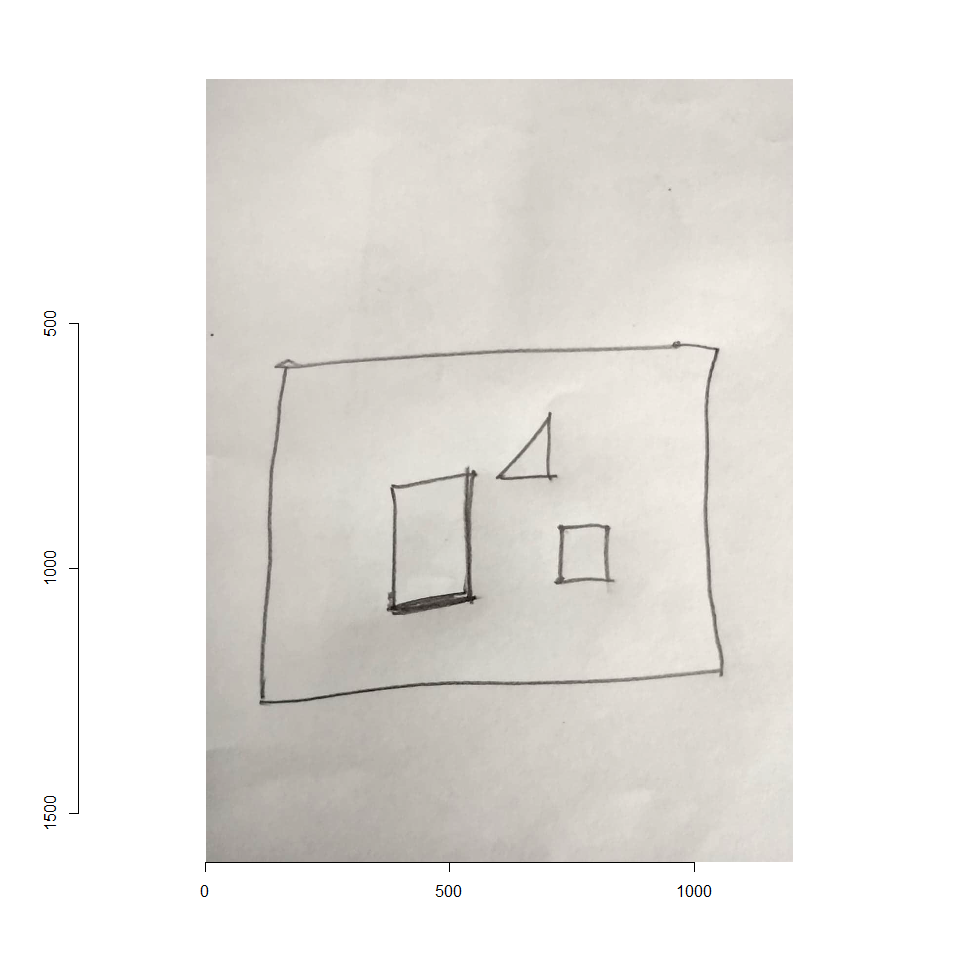
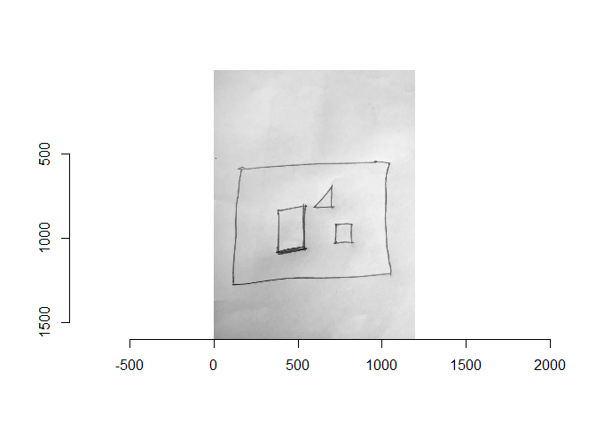
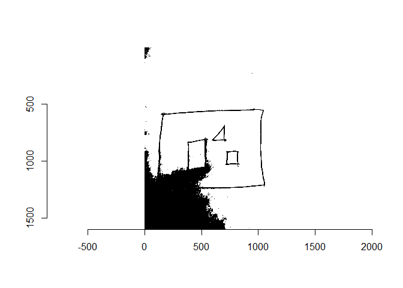
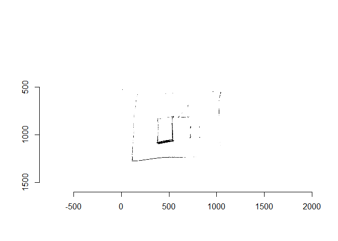
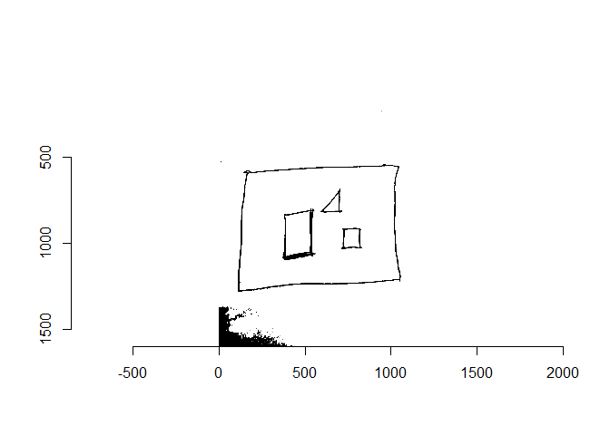
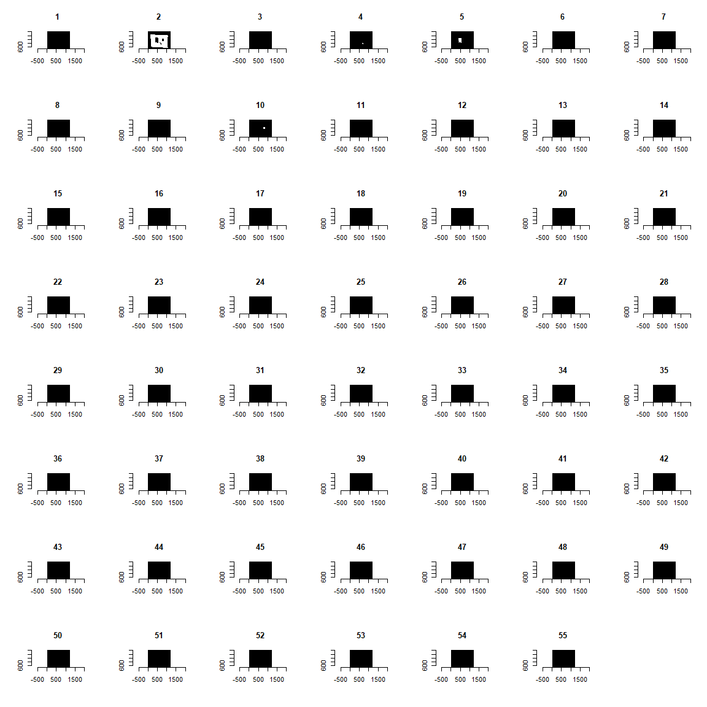
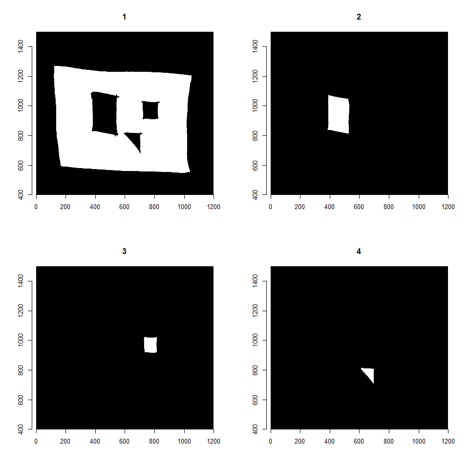
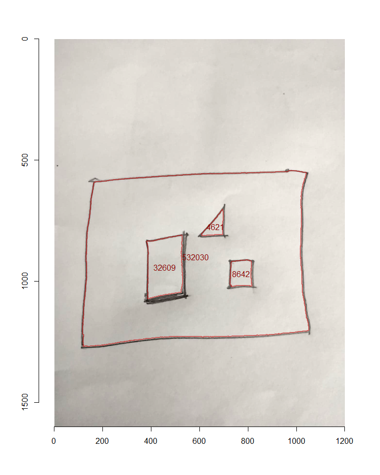
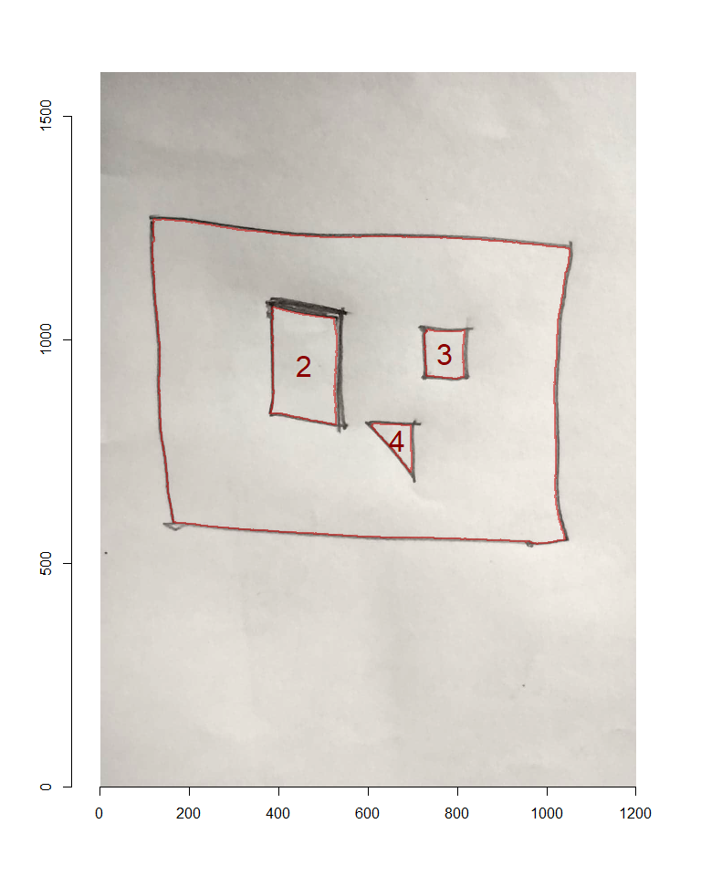

Calculate area of shapes in hand-drawn map
================
barrett wolfe
July 1 2022

The goal is to automatically detect hand-drawn regions on a hand drawn
map and calculate the area.

Area will be calculated in pixels, to convert to pixels I’d recommend
manually measuring a feature of known dimensions in pixels (doable in R
but you’d probably be better off using imageJ), and then it is a simple
conversion from pixels to whatever units of area.

Also, this works if the map can be considered planar (i.e, it explicitly
is or if not the extent is small enough the error will be negligible)


``` r
library(imager)
library(scales)
library(Momocs)
```

\####First load this beautiful hand drawn map:

``` r
img <- load.image("areas.jpg")
plot(img)
```

<!-- -->

\####Convert to grayscale for processing:

``` r
img.g <- grayscale(img)
plot(img.g)
```

<!-- -->

#### Thresholding to detect polygons:

\####You want the contrast of ink vs paper as high as possible when
scanning. Also, you likely will need to tweak the `adjust` parameter to
get the best possible seperation. If you still aren’t getting good
separation of images and background, you might need to do pre-processing
in other software.

`adjust` parameter too high:

``` r
plot(threshold(img.g, adjust = 1))
```

<!-- -->

`adjust` too low:

``` r
plot(threshold(img.g, adjust = 0.6))
```

<!-- -->

`adjust` just right:

``` r
plot(threshold(img.g, adjust = 0.89))
```

<!-- -->
\###Some artifact like in the lower left isn’t an issue if it isn’t
interfering with the areas of interest on the map, better that than not
having solid outlines.

Now to separate the individual areas:

``` r
area.list <- split_connected(threshold(img.g, adjust = 0.89))
```

\####Plotting the whole list will show you if you’ve captured your areas
successfully, the main thing will be that any artifact are smaller than
the smallest areas of interest. That way you can filter by the size of
the areas (number of pixels) to retain only the ‘real’ shapes.

``` r
plot(area.list, xlim = c(100, 1100), ylim = c(500,1400))
```

<!-- -->

``` r
sapply(area.list, \(x)sum(x))
```

    ##  [1]      2 532030     95   4621  32609     20      1      7      1   8642
    ## [11]     37      3     10      3      5      5      5     11     13     11
    ## [21]     24      1      1    139     64    145     24      6      1      6
    ## [31]      7      3      6     24     32      6     16     29      2      3
    ## [41]      3      3      3      2      9     11     70      3      2     11
    ## [51]      3      4     11     29      3

\####Looks like 4000 is our cutoff for a real shape, there are quite a
few smaller ones detected but they are just artifacts. If everything is
working, we should recognise these shapes we have retained:

``` r
real.areas <- area.list[which(sapply(area.list, function(x) sum(x)>4000))]
#in case the main area is not the first, sort by descending order of size
real.areas <- real.areas[order(sapply(real.areas, sum), decreasing = TRUE)]
plot(real.areas,xlim = c(0, 1200), ylim = c(400,1500))
```

<!-- -->

\####Finally, we want the area of each, and for verification we want to
print the area in an outline of each shape. To extact outlines, we need
to convert the shapes to masks (black pixels on empty background) and
identify an xy point inside each shape.

``` r
#centroid of each shape, if it just so happens there is a smaller shape at
#the middle of the main map areas, may just need to provide a coordinate manually
#also if the outlines later on are flipped, switch the commented line in the
#function below

centroids <-
  round(coo_centpos(Out(lapply(real.areas, function(x) {
    which(apply(as.matrix(x),1,rev), arr.ind = TRUE)
#   which(as.matrix(x), arr.ind = TRUE)
      }))),
  0)

#also for whatever reason these were plotting in mirrored locations, just for 
#simplicity I'll just flip them for plotting
label_pos <-
  round(coo_centpos(Out(lapply(real.areas, function(x) {
    which(apply(apply(as.matrix(x),1,rev),2,rev), arr.ind = TRUE)
#   which(as.matrix(x), arr.ind = TRUE)
      }))),
  0)

#inverting shapes
real.inv <- as.imlist(lapply(real.areas, \(x)!x))


outlines <- mapply(\(x,y) {
  x1 <- as.matrix(as.cimg(x))
 #if outlines are flipped incorrectly, remove the following line
   x1 <- apply(x1, 1, rev)
import_Conte(x1,centroids[y,])
    },
  x = real.inv,  y= 1:nrow(centroids))


plot(img, xlim = c(0,1200), ylim = c(1600,0))
sapply(outlines, \(x) {
  lines(x[,1],x[,2],col = alpha("red3", 0.5), lwd = 2)
  })
```

    ## [[1]]
    ## NULL
    ## 
    ## [[2]]
    ## NULL
    ## 
    ## [[3]]
    ## NULL
    ## 
    ## [[4]]
    ## NULL

``` r
text(label_pos[,2], label_pos[,1],
     labels = sapply(real.areas, function(x) sum(x)),
     col = "red4")
```

<!-- -->

\####That is a bit busy so maybe we are better off just numbering them
so they can be matched to the area in a vector. Also, I’ll remove the
area of the ‘background’ and instead include the total area (sum of
shapes and background).

``` r
plot(img, xlim = c(0,1200), ylim = c(0,1600))
sapply(outlines, \(x) {
  lines(x[,1],x[,2],col = alpha("red3", 0.5), lwd = 2)
  })
```

    ## [[1]]
    ## NULL
    ## 
    ## [[2]]
    ## NULL
    ## 
    ## [[3]]
    ## NULL
    ## 
    ## [[4]]
    ## NULL

``` r
text(label_pos[-1,2], label_pos[-1,1],
     labels = 2:length(real.areas),
     col = "red4", cex = 2)
```

<!-- -->

``` r
area_tab <- data.frame(Region = 1:length(real.areas),
                       Area_in_pixels = sapply(real.areas, function(x) sum(x))
)
area_tab[nrow(area_tab)+1,] <- c("Total", sum(area_tab$Area_in_pixels))

knitr::kable(area_tab[-1,], col.names = gsub("_", " ", names(area_tab)))
```

|     | Region | Area in pixels |
|:----|:-------|:---------------|
| 2   | 2      | 32609          |
| 3   | 3      | 8642           |
| 4   | 4      | 4621           |
| 5   | Total  | 577902         |
